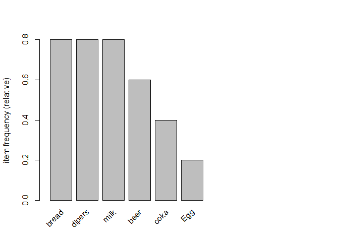
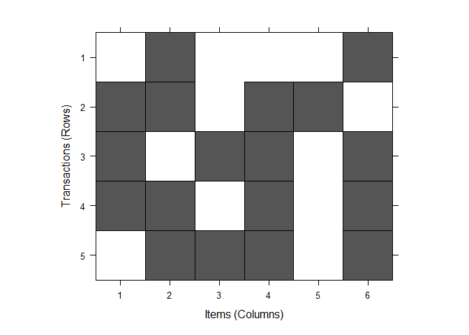
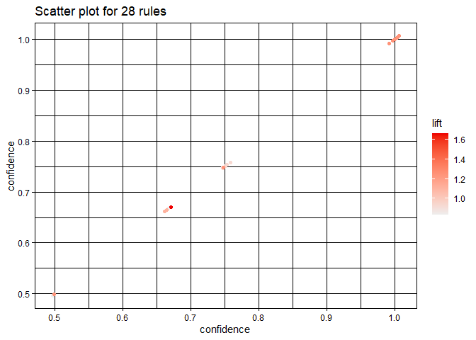
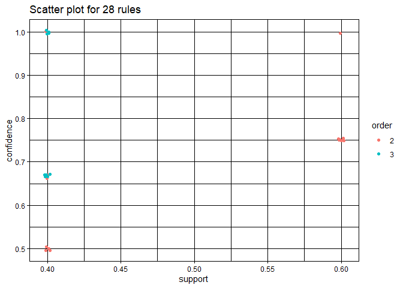
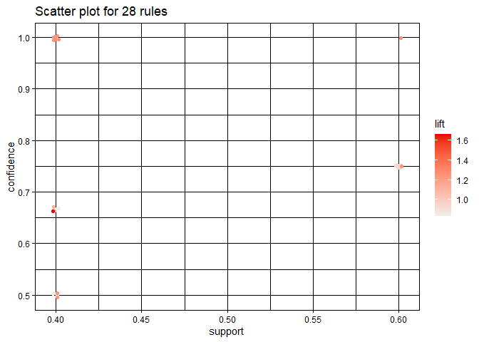
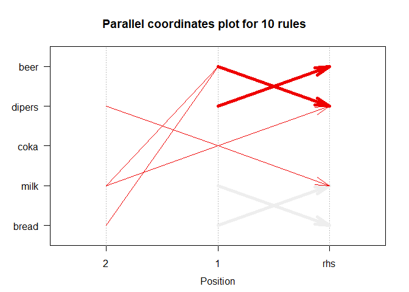

# Association Rules Mining:

Association rule mining (also called as Association Rule Learning) is a
common technique used to find associations (co-occurrence) between many
variables.It is mostly useable in grocery stores, e-commerce websites,
and as well as with large transactional data basese.

A most common example that in cour daily lives **Amazon knows what else
you want to buy when we order something on their site.**

The same idea extends to Spotify too: They know what song you want to
listen to next.

## Use of Association Mining Results:

-   Changing the store layout according to trends

-   Customer behavior analysis

-   Catalogue design

-   Cross markteing on online store

-   What are the trending items customers buy

-   Customized email with add-on sales

## When Association Mining is used ??

Association rule mining is used when we want to find an association
between diffrent objects in a set, find frequent patterns in a
transaction database, relational databases or any other information
repository. The association rule mining are found in
`Marketing Basket Analysis` in tetailling clustering and classification.

It can tell us what items do customers frequently buy together by
generating a set of rules called **Association Rules.** . In simple
words, it gives us output as rules in form **if this then that.**

## What is Apriori Algorithm and Rule ??

Association rule mining is usually done on transcation data fram a
retail market or form an online e-commerce store. Sine most transactions
data is large, the `apriori algorithm` makes it easier to find these
patterns or rules quickly. Using all the rules in the data with
apriori() is not a good idea!

**Rule** A rule is a notation that represents which items is frequently
bougth with what items.

It has `LHS` and `RHS` part and can be represent as follow,

    `itemssetA => itemssetB`

## Association Rule:

### Support:

Association rule are given in the following form,

`A=>B[support, confidence]`

Where A and B are sets of items in the transation data. A and B are
disjoint sets.

Support = Number of transactions with both A and B / Total number of
transactions = P(A∩B) = frequency(A, B)/N

### Confidence:

Confidence = Number of transactions with both A and B / Total number of
transactions with A = P(A∩B)/P(A) = frequenc(A, B)/frequency(A)

### Expected Confidence:

Expected Confidence = Number of transactions withB/Total number of
transactions = P(B) = frequency(B)/N

### List:

Lift = Confidence/ExpectedConfidence =P(A∩B)/P(A).P(B) =
Support(A,B)/Support(A).Support(B)

## Let’s Do Association Rule Mining in R.

### Create a list of baskets

``` r
market_basket<- list(c("bread", "milk"),
                     c("bread","dipers","beer","Egg"),
                     c("milk","dipers","beer","coka"),
                     c("bread","milk","dipers","beer"),
                     c("bread","milk","dipers","coka")
                     )
names(market_basket) <- paste("T",c(1:5),sep = "")
market_basket
```

    ## $T1
    ## [1] "bread" "milk" 
    ## 
    ## $T2
    ## [1] "bread"  "dipers" "beer"   "Egg"   
    ## 
    ## $T3
    ## [1] "milk"   "dipers" "beer"   "coka"  
    ## 
    ## $T4
    ## [1] "bread"  "milk"   "dipers" "beer"  
    ## 
    ## $T5
    ## [1] "bread"  "milk"   "dipers" "coka"

We built the five transcations from the list of above data and gave
names respectively, T1,T2,T2,T4,T5.

Now let’s use `arules packages` of performing further association rule
mining tasks. We should have installed mention packages to go forward.

### 

``` r
library(arules)
```

    ## Warning: package 'arules' was built under R version 4.1.2

    ## Loading required package: Matrix

    ## 
    ## Attaching package: 'arules'

    ## The following objects are masked from 'package:base':
    ## 
    ##     abbreviate, write

Let’s make Transformation of transactions.

``` r
trans <- as(market_basket,"transactions")
```

Let’s check dimension of trans variable,

``` r
dim(trans)
```

    ## [1] 5 6

Here we got 5 6 as answer, it means that we have 5 transactions and 6
items. let’s check items labels,

``` r
labels(trans)
```

    ## [1] "{bread,milk}"             "{beer,bread,dipers,Egg}" 
    ## [3] "{beer,coka,dipers,milk}"  "{beer,bread,dipers,milk}"
    ## [5] "{bread,coka,dipers,milk}"

Here we got items names we have.

``` r
summary(trans)
```

    ## transactions as itemMatrix in sparse format with
    ##  5 rows (elements/itemsets/transactions) and
    ##  6 columns (items) and a density of 0.6 
    ## 
    ## most frequent items:
    ##   bread  dipers    milk    beer    coka (Other) 
    ##       4       4       4       3       2       1 
    ## 
    ## element (itemset/transaction) length distribution:
    ## sizes
    ## 2 4 
    ## 1 4 
    ## 
    ##    Min. 1st Qu.  Median    Mean 3rd Qu.    Max. 
    ##     2.0     4.0     4.0     3.6     4.0     4.0 
    ## 
    ## includes extended item information - examples:
    ##   labels
    ## 1   beer
    ## 2  bread
    ## 3   coka
    ## 
    ## includes extended transaction information - examples:
    ##   transactionID
    ## 1            T1
    ## 2            T2
    ## 3            T3

### Let’s inspect the `trans`

``` r
inspect(trans)
```

    ##     items                       transactionID
    ## [1] {bread, milk}               T1           
    ## [2] {beer, bread, dipers, Egg}  T2           
    ## [3] {beer, coka, dipers, milk}  T3           
    ## [4] {beer, bread, dipers, milk} T4           
    ## [5] {bread, coka, dipers, milk} T5

It is better to use inspect function. It will show 10 transaction. If
our data is very large there will form greater numbers of transaction
inspect function becomes handly in this condition.

### Relative frequency plot and plot of trans

``` r
itemFrequencyPlot(trans, topN=10, cex.names =1)
```


most sold items were `bread`, `milk` and `beer` similarly less sold item
is `Egg`.

``` r
image(trans)
```


## Why Apriori Algorithms is important here.

Frequent Item set Generation is the most computationally expensive step
because it requires a full database scan.In above example, we have seen
the example of only 5 transactions, but in real-world transaction data
for retail can exceed up to GBs and TBs of data for which anoptimized
algorithm is needed to prune out Item-sets that will not help in later
steps.

##Apriori algorithm of “trans” without/with min. support of 0.3 and min.
confidence of 0.5.

``` r
rues <- apriori(trans)
```

    ## Apriori
    ## 
    ## Parameter specification:
    ##  confidence minval smax arem  aval originalSupport maxtime support minlen
    ##         0.8    0.1    1 none FALSE            TRUE       5     0.1      1
    ##  maxlen target  ext
    ##      10  rules TRUE
    ## 
    ## Algorithmic control:
    ##  filter tree heap memopt load sort verbose
    ##     0.1 TRUE TRUE  FALSE TRUE    2    TRUE
    ## 
    ## Absolute minimum support count: 0 
    ## 
    ## set item appearances ...[0 item(s)] done [0.00s].
    ## set transactions ...[6 item(s), 5 transaction(s)] done [0.00s].
    ## sorting and recoding items ... [6 item(s)] done [0.00s].
    ## creating transaction tree ... done [0.00s].
    ## checking subsets of size 1 2 3 4 done [0.00s].
    ## writing ... [31 rule(s)] done [0.00s].
    ## creating S4 object  ... done [0.00s].

``` r
rules
```

    ## function (rhs, lhs, itemLabels, quality = data.frame()) 
    ## {
    ##     if (!is(lhs, "itemMatrix")) 
    ##         lhs <- encode(lhs, itemLabels = itemLabels)
    ##     if (!is(rhs, "itemMatrix")) 
    ##         rhs <- encode(rhs, itemLabels = itemLabels)
    ##     new("rules", lhs = lhs, rhs = rhs, quality = quality)
    ## }
    ## <bytecode: 0x0000000022947bd8>
    ## <environment: namespace:arules>

Here, we made set of 15 rules.

``` r
rules <- apriori(trans, parameter = list(supp=0.3,conf=0.5,
                                         maxlen=10,
                                         target ="rules"))
```

    ## Apriori
    ## 
    ## Parameter specification:
    ##  confidence minval smax arem  aval originalSupport maxtime support minlen
    ##         0.5    0.1    1 none FALSE            TRUE       5     0.3      1
    ##  maxlen target  ext
    ##      10  rules TRUE
    ## 
    ## Algorithmic control:
    ##  filter tree heap memopt load sort verbose
    ##     0.1 TRUE TRUE  FALSE TRUE    2    TRUE
    ## 
    ## Absolute minimum support count: 1 
    ## 
    ## set item appearances ...[0 item(s)] done [0.00s].
    ## set transactions ...[6 item(s), 5 transaction(s)] done [0.00s].
    ## sorting and recoding items ... [5 item(s)] done [0.00s].
    ## creating transaction tree ... done [0.00s].
    ## checking subsets of size 1 2 3 done [0.00s].
    ## writing ... [32 rule(s)] done [0.00s].
    ## creating S4 object  ... done [0.00s].

**Note: maxlen= maximum length of the transaction! We could have used
maxlen= 4 here as we know it but this will not be known in real-life!**

### Summary of rules

``` r
summary(rules)
```

    ## set of 32 rules
    ## 
    ## rule length distribution (lhs + rhs):sizes
    ##  1  2  3 
    ##  4 16 12 
    ## 
    ##    Min. 1st Qu.  Median    Mean 3rd Qu.    Max. 
    ##    1.00    2.00    2.00    2.25    3.00    3.00 
    ## 
    ## summary of quality measures:
    ##     support         confidence        coverage           lift       
    ##  Min.   :0.4000   Min.   :0.5000   Min.   :0.4000   Min.   :0.8333  
    ##  1st Qu.:0.4000   1st Qu.:0.6667   1st Qu.:0.6000   1st Qu.:0.8333  
    ##  Median :0.4000   Median :0.7500   Median :0.6000   Median :1.0000  
    ##  Mean   :0.4938   Mean   :0.7474   Mean   :0.6813   Mean   :1.0473  
    ##  3rd Qu.:0.6000   3rd Qu.:0.8000   3rd Qu.:0.8000   3rd Qu.:1.2500  
    ##  Max.   :0.8000   Max.   :1.0000   Max.   :1.0000   Max.   :1.6667  
    ##      count      
    ##  Min.   :2.000  
    ##  1st Qu.:2.000  
    ##  Median :2.000  
    ##  Mean   :2.469  
    ##  3rd Qu.:3.000  
    ##  Max.   :4.000  
    ## 
    ## mining info:
    ##   data ntransactions support confidence
    ##  trans             5     0.3        0.5
    ##                                                                                            call
    ##  apriori(data = trans, parameter = list(supp = 0.3, conf = 0.5, maxlen = 10, target = "rules"))

Here, set of 32 rules are bulit. Among them 4 rules are in transaction
1, 16 in 2 and 12 in 3. Here some empty rues also generated. let’s
remove these empty rules.

``` r
rules <- apriori(trans, parameter = list(supp=0.3,conf = 0.5,
                                         maxlen =10,
                                         minlen=2,
                                         target="rules"))
```

    ## Apriori
    ## 
    ## Parameter specification:
    ##  confidence minval smax arem  aval originalSupport maxtime support minlen
    ##         0.5    0.1    1 none FALSE            TRUE       5     0.3      2
    ##  maxlen target  ext
    ##      10  rules TRUE
    ## 
    ## Algorithmic control:
    ##  filter tree heap memopt load sort verbose
    ##     0.1 TRUE TRUE  FALSE TRUE    2    TRUE
    ## 
    ## Absolute minimum support count: 1 
    ## 
    ## set item appearances ...[0 item(s)] done [0.00s].
    ## set transactions ...[6 item(s), 5 transaction(s)] done [0.00s].
    ## sorting and recoding items ... [5 item(s)] done [0.00s].
    ## creating transaction tree ... done [0.00s].
    ## checking subsets of size 1 2 3 done [0.00s].
    ## writing ... [28 rule(s)] done [0.00s].
    ## creating S4 object  ... done [0.00s].

## Let”s set RHS rule for trans data

``` r
# we set rhs =beer and default = lhs
beer_rules_rhs<- apriori(trans, parameter = list(supp= 0.3,conf= 0.5,
                                                 maxlen= 10,
                                                 minlen=2),
                         appearance = list(default="lhs",
                                           rhs ="beer"))
```

    ## Apriori
    ## 
    ## Parameter specification:
    ##  confidence minval smax arem  aval originalSupport maxtime support minlen
    ##         0.5    0.1    1 none FALSE            TRUE       5     0.3      2
    ##  maxlen target  ext
    ##      10  rules TRUE
    ## 
    ## Algorithmic control:
    ##  filter tree heap memopt load sort verbose
    ##     0.1 TRUE TRUE  FALSE TRUE    2    TRUE
    ## 
    ## Absolute minimum support count: 1 
    ## 
    ## set item appearances ...[1 item(s)] done [0.00s].
    ## set transactions ...[6 item(s), 5 transaction(s)] done [0.00s].
    ## sorting and recoding items ... [5 item(s)] done [0.00s].
    ## creating transaction tree ... done [0.00s].
    ## checking subsets of size 1 2 3 done [0.00s].
    ## writing ... [5 rule(s)] done [0.00s].
    ## creating S4 object  ... done [0.00s].

``` r
inspect(beer_rules_rhs)
```

    ##     lhs                rhs    support confidence coverage lift      count
    ## [1] {bread}         => {beer} 0.4     0.5000000  0.8      0.8333333 2    
    ## [2] {milk}          => {beer} 0.4     0.5000000  0.8      0.8333333 2    
    ## [3] {dipers}        => {beer} 0.6     0.7500000  0.8      1.2500000 3    
    ## [4] {bread, dipers} => {beer} 0.4     0.6666667  0.6      1.1111111 2    
    ## [5] {dipers, milk}  => {beer} 0.4     0.6666667  0.6      1.1111111 2

Persons who bought the beer his r her maximum previous bought item was
dipers similarly second maximum previous sold items were breads,dipers
and dipers and milk. It is very intresting insights of data. From this
result we can make sence most probably father’s went to take baby’s
things from grocery.

## Let’s put beer in LHS and set RHs as defsult values.

``` r
beer_rules_lhs <- apriori(trans, parameter = list(supp=0.3,conf=0.5,
                                                  maxlen =10,
                                                  minlen =2),
                          appearance = list(default="rhs",lhs ="beer"))
```

    ## Apriori
    ## 
    ## Parameter specification:
    ##  confidence minval smax arem  aval originalSupport maxtime support minlen
    ##         0.5    0.1    1 none FALSE            TRUE       5     0.3      2
    ##  maxlen target  ext
    ##      10  rules TRUE
    ## 
    ## Algorithmic control:
    ##  filter tree heap memopt load sort verbose
    ##     0.1 TRUE TRUE  FALSE TRUE    2    TRUE
    ## 
    ## Absolute minimum support count: 1 
    ## 
    ## set item appearances ...[1 item(s)] done [0.00s].
    ## set transactions ...[6 item(s), 5 transaction(s)] done [0.00s].
    ## sorting and recoding items ... [5 item(s)] done [0.00s].
    ## creating transaction tree ... done [0.00s].
    ## checking subsets of size 1 2 done [0.00s].
    ## writing ... [3 rule(s)] done [0.00s].
    ## creating S4 object  ... done [0.00s].

``` r
inspect(beer_rules_lhs)
```

    ##     lhs       rhs      support confidence coverage lift      count
    ## [1] {beer} => {bread}  0.4     0.6666667  0.6      0.8333333 2    
    ## [2] {beer} => {milk}   0.4     0.6666667  0.6      0.8333333 2    
    ## [3] {beer} => {dipers} 0.6     1.0000000  0.6      1.2500000 3

Persons who bought beer would bought dipers next. Here we show maximum
beers buy person also buy diapers.

## Product Recommendation rule:

``` r
rules_conf<- sort(rules,by ="confidence",
                  decreasing = TRUE)
inspect(rules_conf)
```

    ##      lhs                rhs      support confidence coverage lift      count
    ## [1]  {coka}          => {milk}   0.4     1.0000000  0.4      1.2500000 2    
    ## [2]  {coka}          => {dipers} 0.4     1.0000000  0.4      1.2500000 2    
    ## [3]  {beer}          => {dipers} 0.6     1.0000000  0.6      1.2500000 3    
    ## [4]  {coka, milk}    => {dipers} 0.4     1.0000000  0.4      1.2500000 2    
    ## [5]  {coka, dipers}  => {milk}   0.4     1.0000000  0.4      1.2500000 2    
    ## [6]  {beer, milk}    => {dipers} 0.4     1.0000000  0.4      1.2500000 2    
    ## [7]  {beer, bread}   => {dipers} 0.4     1.0000000  0.4      1.2500000 2    
    ## [8]  {dipers}        => {beer}   0.6     0.7500000  0.8      1.2500000 3    
    ## [9]  {milk}          => {bread}  0.6     0.7500000  0.8      0.9375000 3    
    ## [10] {bread}         => {milk}   0.6     0.7500000  0.8      0.9375000 3    
    ## [11] {milk}          => {dipers} 0.6     0.7500000  0.8      0.9375000 3    
    ## [12] {dipers}        => {milk}   0.6     0.7500000  0.8      0.9375000 3    
    ## [13] {bread}         => {dipers} 0.6     0.7500000  0.8      0.9375000 3    
    ## [14] {dipers}        => {bread}  0.6     0.7500000  0.8      0.9375000 3    
    ## [15] {beer}          => {milk}   0.4     0.6666667  0.6      0.8333333 2    
    ## [16] {beer}          => {bread}  0.4     0.6666667  0.6      0.8333333 2    
    ## [17] {dipers, milk}  => {coka}   0.4     0.6666667  0.6      1.6666667 2    
    ## [18] {beer, dipers}  => {milk}   0.4     0.6666667  0.6      0.8333333 2    
    ## [19] {dipers, milk}  => {beer}   0.4     0.6666667  0.6      1.1111111 2    
    ## [20] {beer, dipers}  => {bread}  0.4     0.6666667  0.6      0.8333333 2    
    ## [21] {bread, dipers} => {beer}   0.4     0.6666667  0.6      1.1111111 2    
    ## [22] {bread, milk}   => {dipers} 0.4     0.6666667  0.6      0.8333333 2    
    ## [23] {dipers, milk}  => {bread}  0.4     0.6666667  0.6      0.8333333 2    
    ## [24] {bread, dipers} => {milk}   0.4     0.6666667  0.6      0.8333333 2    
    ## [25] {milk}          => {coka}   0.4     0.5000000  0.8      1.2500000 2    
    ## [26] {dipers}        => {coka}   0.4     0.5000000  0.8      1.2500000 2    
    ## [27] {milk}          => {beer}   0.4     0.5000000  0.8      0.8333333 2    
    ## [28] {bread}         => {beer}   0.4     0.5000000  0.8      0.8333333 2

In above results we sort the rules according to confidence in decresing
order.

## Plotting rules with “arulesViz” package

``` r
library(arulesViz)
```

    ## Warning: package 'arulesViz' was built under R version 4.1.2

``` r
plot(rules)
```

    ## To reduce overplotting, jitter is added! Use jitter = 0 to prevent jitter.


Here, darker orange color indicate those items whose lift value is
maximun when lift values decrease colar also become light orange.

Let’s plot the same plot by setting `measure = "confidence"`.

``` r
plot(rules, measure = "confidence")
```

    ## To reduce overplotting, jitter is added! Use jitter = 0 to prevent jitter.


## plot `two-key-plot`

``` r
library(arulesViz)
plot(rules, method = 'two-key plot')
```

    ## To reduce overplotting, jitter is added! Use jitter = 0 to prevent jitter.


## Interactive plot with “plotly” engine

``` r
library(ggplot2)

plot(rules, engine = "ggplot2")
```

    ## To reduce overplotting, jitter is added! Use jitter = 0 to prevent jitter.


If we hover our curcer above orange points we can see the value of supp,
conf as well as left. Darker the orange color more will be the value of
corresponing parameters.

## Graph Based Visualization

``` r
subrules<- head(rules, n=10,by ="confidence")
plot(subrules, method= "graph",engine = "htmlwidget")
```

<div id="htmlwidget-c33381e2f284e06a4e81" style="width:672px;height:480px;" class="visNetwork html-widget"></div>
<script type="application/json" data-for="htmlwidget-c33381e2f284e06a4e81">{"x":{"nodes":{"id":[1,2,3,4,5,6,7,8,9,10,11,12,13,14,15],"label":["beer","bread","coka","dipers","milk","rule 1","rule 2","rule 3","rule 4","rule 5","rule 6","rule 7","rule 8","rule 9","rule 10"],"group":[1,1,1,1,1,2,2,2,2,2,2,2,2,2,2],"value":[1,1,1,1,1,1,1,100,1,1,1,1,100,100,100],"color":["#CBD2FC","#CBD2FC","#CBD2FC","#CBD2FC","#CBD2FC","#EE1B1B","#EE1B1B","#EE1B1B","#EE1B1B","#EE1B1B","#EE1B1B","#EE1B1B","#EE1B1B","#EEDCDC","#EEDCDC"],"title":["beer","bread","coka","dipers","milk","<B>[1]<\/B><BR><B>{coka}<\/B><BR>&nbsp;&nbsp; => <B>{milk}<\/B><BR><BR>support = 0.4<BR>confidence = 1<BR>coverage = 0.4<BR>lift = 1.25<BR>count = 2<BR>order = 2<BR>id = 1","<B>[2]<\/B><BR><B>{coka}<\/B><BR>&nbsp;&nbsp; => <B>{dipers}<\/B><BR><BR>support = 0.4<BR>confidence = 1<BR>coverage = 0.4<BR>lift = 1.25<BR>count = 2<BR>order = 2<BR>id = 2","<B>[3]<\/B><BR><B>{beer}<\/B><BR>&nbsp;&nbsp; => <B>{dipers}<\/B><BR><BR>support = 0.6<BR>confidence = 1<BR>coverage = 0.6<BR>lift = 1.25<BR>count = 3<BR>order = 2<BR>id = 3","<B>[4]<\/B><BR><B>{coka,<BR>&nbsp;&nbsp;milk}<\/B><BR>&nbsp;&nbsp; => <B>{dipers}<\/B><BR><BR>support = 0.4<BR>confidence = 1<BR>coverage = 0.4<BR>lift = 1.25<BR>count = 2<BR>order = 3<BR>id = 4","<B>[5]<\/B><BR><B>{coka,<BR>&nbsp;&nbsp;dipers}<\/B><BR>&nbsp;&nbsp; => <B>{milk}<\/B><BR><BR>support = 0.4<BR>confidence = 1<BR>coverage = 0.4<BR>lift = 1.25<BR>count = 2<BR>order = 3<BR>id = 5","<B>[6]<\/B><BR><B>{beer,<BR>&nbsp;&nbsp;milk}<\/B><BR>&nbsp;&nbsp; => <B>{dipers}<\/B><BR><BR>support = 0.4<BR>confidence = 1<BR>coverage = 0.4<BR>lift = 1.25<BR>count = 2<BR>order = 3<BR>id = 6","<B>[7]<\/B><BR><B>{beer,<BR>&nbsp;&nbsp;bread}<\/B><BR>&nbsp;&nbsp; => <B>{dipers}<\/B><BR><BR>support = 0.4<BR>confidence = 1<BR>coverage = 0.4<BR>lift = 1.25<BR>count = 2<BR>order = 3<BR>id = 7","<B>[8]<\/B><BR><B>{dipers}<\/B><BR>&nbsp;&nbsp; => <B>{beer}<\/B><BR><BR>support = 0.6<BR>confidence = 0.75<BR>coverage = 0.8<BR>lift = 1.25<BR>count = 3<BR>order = 2<BR>id = 8","<B>[9]<\/B><BR><B>{milk}<\/B><BR>&nbsp;&nbsp; => <B>{bread}<\/B><BR><BR>support = 0.6<BR>confidence = 0.75<BR>coverage = 0.8<BR>lift = 0.938<BR>count = 3<BR>order = 2<BR>id = 9","<B>[10]<\/B><BR><B>{bread}<\/B><BR>&nbsp;&nbsp; => <B>{milk}<\/B><BR><BR>support = 0.6<BR>confidence = 0.75<BR>coverage = 0.8<BR>lift = 0.938<BR>count = 3<BR>order = 2<BR>id = 10"],"shape":["box","box","box","box","box","circle","circle","circle","circle","circle","circle","circle","circle","circle","circle"],"x":[0.210113734895035,-0.91459333003511,0.647103715364115,0.467267864637772,-0.257001237380117,0.116552590357373,1,0.572123743748249,0.430148369399016,0.260325308989713,0.0152624659269942,-0.268608260288109,0.785318765891957,-0.880870039112702,-1],"y":[-0.835613053196886,-0.170127628019081,0.724119130662743,-0.268364009341342,0.40328056258774,1,0.246235224468974,-1,0.281009437568486,0.426487798907675,-0.254029878384359,-0.56537886284356,-0.759408244496835,0.449043551588226,0.214621326737272]},"edges":{"from":[3,3,1,3,5,3,4,1,5,1,2,4,5,2,6,7,8,9,10,11,12,13,14,15],"to":[6,7,8,9,9,10,10,11,11,12,12,13,14,15,5,4,4,4,5,4,4,1,2,5],"arrows":["to","to","to","to","to","to","to","to","to","to","to","to","to","to","to","to","to","to","to","to","to","to","to","to"]},"nodesToDataframe":true,"edgesToDataframe":true,"options":{"width":"100%","height":"100%","nodes":{"shape":"dot","physics":false},"manipulation":{"enabled":false},"edges":{"smooth":false},"physics":{"stabilization":false},"interaction":{"hover":true,"zoomSpeed":1}},"groups":["1","2"],"width":null,"height":null,"idselection":{"enabled":true,"style":"width: 150px; height: 26px","useLabels":true,"main":"Select by id"},"byselection":{"enabled":false,"style":"width: 150px; height: 26px","multiple":false,"hideColor":"rgba(200,200,200,0.5)","highlight":false},"main":null,"submain":null,"footer":null,"background":"rgba(0, 0, 0, 0)","igraphlayout":{"type":"square"},"tooltipStay":300,"tooltipStyle":"position: fixed;visibility:hidden;padding: 5px;white-space: nowrap;font-family: verdana;font-size:14px;font-color:#000000;background-color: #f5f4ed;-moz-border-radius: 3px;-webkit-border-radius: 3px;border-radius: 3px;border: 1px solid #808074;box-shadow: 3px 3px 10px rgba(0, 0, 0, 0.2);","highlight":{"enabled":true,"hoverNearest":true,"degree":1,"algorithm":"all","hideColor":"rgba(200,200,200,0.5)","labelOnly":true},"collapse":{"enabled":false,"fit":false,"resetHighlight":true,"clusterOptions":null,"keepCoord":true,"labelSuffix":"(cluster)"}},"evals":[],"jsHooks":[]}</script>

Here we can select particular items and rules to see more detail about
it.

## Parallel Coordinate plot for 10 rules:

``` r
plot(subrules, method = "paracoord")
```


To visualize in higher dimensional space we used parallel coordinate
method. Here we visualize in 10 dimensions.
