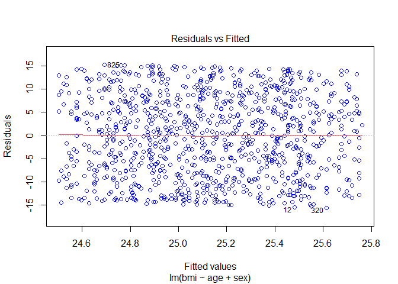
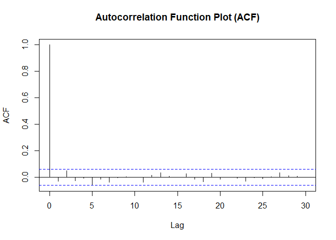
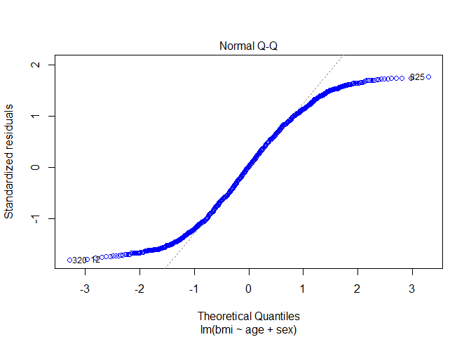
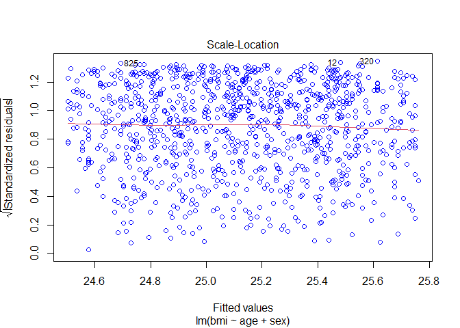

## 1. For Replication setting Roll Number as random seed

``` r
set.seed(11)
```

## 2. Create two quantitative variables: age and body-mass index (BMI) with random samples of size 1000 each:

-   Age: 0 to 99 (random samples)
-   BMI: 10 to 40 (random samples)

``` r
age<-c(sample(x=seq(0,99),size=1000,replace = TRUE))
bmi<-c(runif(1000,min = 10,max = 40))
```

## 3. Create a binary variable sex (1=Male and 0=Female) of 1000 random samples

``` r
sex<-(sample(x=c("male","female"),size = 1000,replace = TRUE))
sex<-factor(sex,levels = c("female","male"))
```

## 4. Create a data frame as df containing four variables/features:Serial Number, BMI, Age and Sex

``` r
df<-data.frame(
  serial_number=seq(1:1000),
  bmi=bmi,
  age=age,
  sex=sex
)
```

``` r
knitr::kable(head(df))
```

| serial_number |      bmi | age | sex    |
|--------------:|---------:|----:|:-------|
|             1 | 20.07240 |  33 | male   |
|             2 | 12.01615 |  55 | male   |
|             3 | 11.33463 |  24 | female |
|             4 | 24.34372 |  15 | female |
|             5 | 13.12121 |  36 | male   |
|             6 | 34.14313 |  59 | male   |

## 5. Split the data into “train” and “test” data using 80-20 partition

``` r
library(caret)
```

    ## Warning: package 'caret' was built under R version 4.1.2

``` r
ind<-sample(2,nrow(df),replace = T,prob = c(0.8,0.2))
train<-df[ind==1,]
test<-df[ind==2,]
```

## 6. Fit a linear regression model with BMI as dependent variable and age and sex and predictors in the train data samples

``` r
lin_reg<-lm(bmi~age+sex,data=df)
```

``` r
summary(lin_reg)
```

    ## 
    ## Call:
    ## lm(formula = bmi ~ age + sex, data = df)
    ## 
    ## Residuals:
    ##      Min       1Q   Median       3Q      Max 
    ## -15.5977  -7.4958   0.2472   7.3605  15.2747 
    ## 
    ## Coefficients:
    ##              Estimate Std. Error t value Pr(>|t|)    
    ## (Intercept) 24.718502   0.595147  41.533   <2e-16 ***
    ## age          0.010528   0.009328   1.129    0.259    
    ## sexmale     -0.215872   0.547281  -0.394    0.693    
    ## ---
    ## Signif. codes:  0 '***' 0.001 '**' 0.01 '*' 0.05 '.' 0.1 ' ' 1
    ## 
    ## Residual standard error: 8.645 on 997 degrees of freedom
    ## Multiple R-squared:  0.0014, Adjusted R-squared:  -0.0006033 
    ## F-statistic: 0.6988 on 2 and 997 DF,  p-value: 0.4974

``` r
lin_reg
```

    ## 
    ## Call:
    ## lm(formula = bmi ~ age + sex, data = df)
    ## 
    ## Coefficients:
    ## (Intercept)          age      sexmale  
    ##    24.71850      0.01053     -0.21587

## 7. Conduct residual analysis of the fitted model with graphs (suggestive) and tests (confirmative)

### LINE Test

#### 1. Linearity of residuals

``` r
plot(lin_reg,which=1,col=c("blue"))
```



``` r
summary(lin_reg$residuals)
```

    ##     Min.  1st Qu.   Median     Mean  3rd Qu.     Max. 
    ## -15.5977  -7.4958   0.2472   0.0000   7.3605  15.2747

From the graph we can see that the LOESS line lies in the zero line of
the y-axis. From the summary we can see that the Mean of residuals is 0
which means that the residuals are linear. #### 2. Independence of
residuals

``` r
acf(lin_reg$residuals,main="Autocorrelation Function Plot (ACF)")
```



``` r
library(car)
durbinWatsonTest(lin_reg)
```

    ##  lag Autocorrelation D-W Statistic p-value
    ##    1     -0.03032132      2.060267   0.342
    ##  Alternative hypothesis: rho != 0

In the Autocorrelation Function Plot (ACF), the plot shows ups and down
bars on X-axis and P-Value of Durbin-Watson test is also greater than
0.05 so there is no autocorrelation. #### 3. Normality of residuals

``` r
plot(lin_reg,which = 2,col=c("blue"))
```



``` r
shapiro.test(lin_reg$residuals)
```

    ## 
    ##  Shapiro-Wilk normality test
    ## 
    ## data:  lin_reg$residuals
    ## W = 0.95691, p-value < 2.2e-16

From the Normal Q-Q plot we can see the data does not lie in the
theoretical normal line and also from Shapiro-Wilk normality test we can
see that p-value is less than 0.05 which means that the residuals do not
follow normal distribution.

#### 4. Equal variance (homoscedasticity) of residuals

``` r
plot(lin_reg, which=3, col=c("blue"))
```



``` r
library(lmtest)
```

    ## Warning: package 'lmtest' was built under R version 4.1.2

``` r
bptest(lin_reg)
```

    ## 
    ##  studentized Breusch-Pagan test
    ## 
    ## data:  lin_reg
    ## BP = 1.2112, df = 2, p-value = 0.5457

The Scatter plot of standardize residuals (y-axis) and standardized
predicted values (x-axis) shows values are distributed randomly. Also,
the P-Value of Breusch-Pagan test is greater than 0.05 we can say that
variances are equal (homoscedasticity is present)

Even though the model failed Normality of residuals test we will move
forward with the prediction.

## 8. Use the fitted model to predict the random test data samples

``` r
lin_pred<-predict(lin_reg,newdata = test)
```

## 9. Get R-square, MSE and RMSE for training as well as test data and interpret them carefully

``` r
R2=R2(lin_pred,test$bmi)
RMSE = RMSE(lin_pred,test$bmi)
MAE = MAE(lin_pred,test$bmi)
print(paste("R2: ",R2))
```

    ## [1] "R2:  0.000893326472634511"

``` r
print(paste("RMSE: ",RMSE))
```

    ## [1] "RMSE:  9.15650391435553"

``` r
print(paste("MAE: ",MAE))
```

    ## [1] "MAE:  8.13936513787792"

The value of R2(R-Square) is very low 0.0235 i.e only 2.35% of the
variance in the dependent variable is explained by independent
variables. In other words, we can say that age and sex are not very good
predictor of BMI.

## 10. Take decision and write conclusion based on all the results obtained so far

Since the value of R2 is very low less than 50% in both train and test
so, we can say that age and sex not very good predictor of BMI. Also,
the model failed normality of residuals test so we should not use this
model to make any conclusion.
