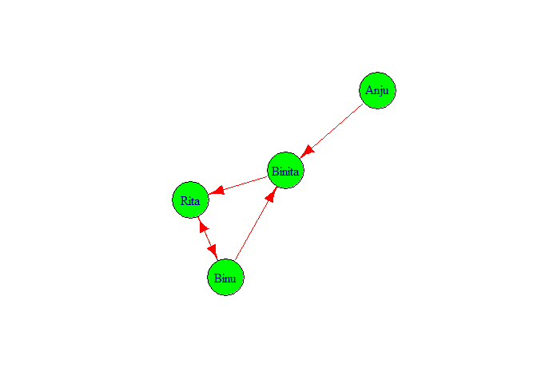

# Social Network Analysis

## Defination

Social networks are simply networks of social interactions and personal
relationships. Think about our group of friends and how we got to know
them. Maybe we met them while our from our schooling, or maybe we met
them through a hobby or through our community. In fact, 72% of all
Internet users are active on social media today, indulging in social
interactions and developing personal relationships. However to
understhand about social networks we only don’t need to go through
internet or social media they may come in variety of form in our daily
life.

## Social Network Analysis

Social network analysis (SNA), also known as network science, is a field
of data analytics that uses networks and graph theory to understand
social structures. We can see network around us such as road network,
online network, network of social media such as facebook, twitter etc.
Learning SNA give us to explore insight of various data sources.

## SNA Graph

We all are familier about the graph which simply the collection of non
sero vertex and edge. In order to build SNA graphs, two key components
are required actors and relationships. Here actors represents the vertex
and relationship means the edge between two actors. Let us write SNA
graph in R code. To do this at first we should have `igraph` package
already install in our R or R studio.

``` r
library(igraph)
```

    ## 
    ## Attaching package: 'igraph'

    ## The following objects are masked from 'package:stats':
    ## 
    ##     decompose, spectrum

    ## The following object is masked from 'package:base':
    ## 
    ##     union

``` r
g <- graph(c(1,2))
plot(g)
```

 In
figure we can see the directed graph from node 1 to node 2. From above
graph it is also clear that by default it produced directed graph. In
above figure we can not clearly see node and edge so let’s increase its
size and give different color to the node.

``` r
plot(g,
vertex.color = 'green',
vertex.size = 40,
edge.color ='red',
edge.size = 20)
```

 Now we
change the node color and node font size. Add more node on graph foe
this we follow the following code.

``` r
g <- graph(c(1,2,2,3,3,4,4,1))
plot(g,
     vertex.color = 'green',
     vertex.size =40,
     edge.color = 'red',
     edge.size = 20)
```

 We got
the graph with four vertex 1,2,3,4. Here we also got directed graph.
Let’s make it for this we need to write directed is false.

``` r
g <- graph(c(1,2,2,3,3,4,4,1),directed = FALSE)
plot(g,
     vertex.color = 'green',
     vertex.size =40,
     edge.color = 'red',
     edge.size = 20)
```

 We got
our desirable type of graph. Now let’s move forword. We can give the
number of vertex with out writing them for this look following code.

``` r
g <- graph(c(1,2,2,3,3,4,4,1), 
directed = F, n=7)
plot(g,
     vertex.color = 'green',
     vertex.size =40,
     edge.color = 'red',
     edge.size = 20)
```

 In
above graph we give seven vertex number among them we see three isolated
nodes. The reason to come isolated node is that we do not specify the
edge or relationship between them. Also from graph we can make sence
that this is not directed graph.

## Adjacency Matrix

Let see what will happen if we type only `g[]`.

``` r
g[]
```

    ## 7 x 7 sparse Matrix of class "dgCMatrix"
    ##                   
    ## [1,] . 1 . 1 . . .
    ## [2,] 1 . 1 . . . .
    ## [3,] . 1 . 1 . . .
    ## [4,] 1 . 1 . . . .
    ## [5,] . . . . . . .
    ## [6,] . . . . . . .
    ## [7,] . . . . . . .

This give us the 7cross 7 adjacency matrix. Adjancency matrix is matix
where we give 1 if if there is edge between two vertex if not then we
give 0. But in above matrix it give simply `.` instead of zero.

Let us try to build our graph by keeping text data in place of number.

``` r
g1 <-
graph(c("Binu","Binita","Binita","Rita"
,"Rita","Binu","Binu","Rita", "Anju", 
"Binita"))
plot(g1,
vertex.color = "green",
vertex.size = 40,
edge.color = "red",
edge.size = 5)
```

 If we
want to check the features of g1 we simply type g1 and press control and
entre key we got following output.

``` r
g1
```

    ## IGRAPH d030509 DN-- 4 5 -- 
    ## + attr: name (v/c)
    ## + edges from d030509 (vertex names):
    ## [1] Binu  ->Binita Binita->Rita   Rita  ->Binu   Binu  ->Rita   Anju  ->Binita

It show that in graph there are 4 nodes 5 edges. And edges are directed
from
`Binu  ->Binita, Binita->Rita, Rita  ->Binu, Binu  ->Rita, Anju  ->Binita`.

## Degree

Let’s check the degree of graph g1. To check degree we can do
`degree(g1)` or `degree(g1, mode='all')`.

``` r
degree(g1) 
```

    ##   Binu Binita   Rita   Anju 
    ##      3      3      3      1

Degree of Binu is 3 similarly Anju has degree 1. Also degree means
numbers of connection to each node.

``` r
degree(g1, mode='all')
```

    ##   Binu Binita   Rita   Anju 
    ##      3      3      3      1

## Diameter

Now, let’s check the diameter of graph.

``` r
diameter(g1, directed = F, weights = 
NA)
```

    ## [1] 2

We got two diameter. Diameter means number of edged inside and outside
of SND. i.e `Anju <- Binita <- Rita`, `Anju <- Binita <- Binu`.

## Edge density

Edge density means `ecount(g1)/(vcount(g1)*(vcount(g1) -1))`. we
calculate if from following code.

``` r
edge_density(g1, loops = F)
```

    ## [1] 0.4166667

We got value of edge density 0.4166667

## Reciprocity

Total edges = 5 Tied edges = 2 Reciprocity = 2/5 = 0.4

``` r
reciprocity(g1)
```

    ## [1] 0.4

## closeness

Now getting closeness of graph.

``` r
closeness(g1, mode = "all", weights = NA)
```

    ##      Binu    Binita      Rita      Anju 
    ## 0.2500000 0.3333333 0.2500000 0.2000000

from above result we see that Binita is closest to the others three
persons and Anju is farthest from other three persons.

## Betweenness

Let’s calculate between of g1

``` r
betweenness(g1, directed = T, weights = NA)
```

    ##   Binu Binita   Rita   Anju 
    ##      1      2      2      0

Binita and Rita has 2 inner edge similarly Binu has one inner edge and
Anju has no inner edge.

## Edge Betweenness

For every pair of vertices in a connected graph, there exists at least
one shortest path between the vertices.

``` r
edge_betweenness(g1, directed = T, weights = NA)
```

    ## [1] 2 4 4 1 3

## SNA in Twitterdata

Here I load `Twitterdata` from my local machine.

``` r
load("F:/MDS R/termDocMatrix.rdata")
```

``` r
m<- as.matrix(termDocMatrix)
termM <- m %*% t(m)
termM[1:10,1:10]
```

    ##               Terms
    ## Terms          analysis applications code computing data examples introduction
    ##   analysis           23            0    1         0    4        4            2
    ##   applications        0            9    0         0    8        0            0
    ##   code                1            0    9         0    1        6            0
    ##   computing           0            0    0        10    2        0            0
    ##   data                4            8    1         2   85        5            3
    ##   examples            4            0    6         0    5       17            2
    ##   introduction        2            0    0         0    3        2           10
    ##   mining              4            7    3         1   50        5            3
    ##   network            12            0    1         0    0        2            2
    ##   package             2            1    0         2   12        2            0
    ##               Terms
    ## Terms          mining network package
    ##   analysis          4      12       2
    ##   applications      7       0       1
    ##   code              3       1       0
    ##   computing         1       0       2
    ##   data             50       0      12
    ##   examples          5       2       2
    ##   introduction      3       2       0
    ##   mining           64       1       6
    ##   network           1      17       1
    ##   package           6       1      27

Now we have built a term-term adjacency matrix, where the rows and
columns represents terms, and every entry is the number of
co-occurrences of two terms. Next we can build a graph with
graph.adjacency() from package igraph.

``` r
g <- graph.adjacency(termM,weighted = T,mode = 'undirected')
g
```

    ## IGRAPH d066e18 UNW- 21 151 -- 
    ## + attr: name (v/c), weight (e/n)
    ## + edges from d066e18 (vertex names):
    ##  [1] analysis    --analysis     analysis    --code        
    ##  [3] analysis    --data         analysis    --examples    
    ##  [5] analysis    --introduction analysis    --mining      
    ##  [7] analysis    --network      analysis    --package     
    ##  [9] analysis    --positions    analysis    --postdoctoral
    ## [11] analysis    --r            analysis    --research    
    ## [13] analysis    --series       analysis    --slides      
    ## [15] analysis    --social       analysis    --time        
    ## + ... omitted several edges

Here we build graph on `termDocMatrix`. In result we can see the edges
between different dodes.

``` r
g <- simplify(g)
g
```

    ## IGRAPH d06a87e UNW- 21 130 -- 
    ## + attr: name (v/c), weight (e/n)
    ## + edges from d06a87e (vertex names):
    ##  [1] analysis    --code         analysis    --data        
    ##  [3] analysis    --examples     analysis    --introduction
    ##  [5] analysis    --mining       analysis    --network     
    ##  [7] analysis    --package      analysis    --positions   
    ##  [9] analysis    --postdoctoral analysis    --r           
    ## [11] analysis    --research     analysis    --series      
    ## [13] analysis    --slides       analysis    --social      
    ## [15] analysis    --time         analysis    --tutorial    
    ## + ... omitted several edges

Function simplify() in igraph handily removes self-loops from a network.
We can see in previous graph there are 151 edges in second graph there
are only 130 edges. Hence there are 21 self loops they are omitted from
the graph.

## Check Degree of graph and nodes of the graph.

``` r
V(g)$label <- V(g)$name
V(g)$label
```

    ##  [1] "analysis"     "applications" "code"         "computing"    "data"        
    ##  [6] "examples"     "introduction" "mining"       "network"      "package"     
    ## [11] "parallel"     "positions"    "postdoctoral" "r"            "research"    
    ## [16] "series"       "slides"       "social"       "time"         "tutorial"    
    ## [21] "users"

``` r
V(g)$degree <- degree(g)
V(g)$degree
```

    ##  [1] 17  6  9  9 18 14 12 20 14 13  8  7  8 17  9 11 15 11 11 16 15

We found degree of graph is 20. ## Histogram on the basis of degree

``` r
hist(V(g)$degree, breaks = 100,col = 'green', main = "Frequency Of Degree", 
     xlab = " Degree of vertices", ylab = " Frequency")
```

 We can
see most of nodes have degree 9 and 11. We all khow what is degree of
graph, number of edges that are incident to the node is called degree of
graph.

## Let’s Plot Graph on the Data.

Let set `set.seed(3952)`.

``` r
set.seed(3952)

layout1 <- layout.fruchterman.reingold(g)

plot(g, layout=layout1)
```

 A
different layout can be generated with the first line of code below. The
second line produces an interactive plot, which allows us to manually
rearrange the layout

``` r
plot(g, layout=layout.kamada.kawai)
```

 ## Do
this to make it better.

``` r
V(g)$label.cex <- 2.2 * V(g)$degree / max(V(g)$degree)+ .2

V(g)$label.color <- rgb(0, 0, .2, .8)

V(g)$frame.color <- NA

egam <- (log(E(g)$weight)+.4) / max(log(E(g)$weight)+.4)

E(g)$color <- rgb(.5, .5, 0, egam)

E(g)$width <- egam
# plot the graph in layout1

plot(g, layout=layout1)
```

 Here
size of words appear according to their degree. From graph we can
clearly see that node mining has maximum degree.

## Community detection

Communities are seen as groups, clusters, coherent subgroups, or modules
in different fields; community detection in a social network is
identifying sets of nodes in such a way that the connections of nodes
within a set are more than their connection to other network nodes.

``` r
comm <- cluster_edge_betweenness(g)
```

    ## Warning in cluster_edge_betweenness(g): At community.c:461 :Membership vector
    ## will be selected based on the lowest modularity score.

    ## Warning in cluster_edge_betweenness(g): At community.c:468 :Modularity
    ## calculation with weighted edge betweenness community detection might not make
    ## sense -- modularity treats edge weights as similarities while edge betwenness
    ## treats them as distances

``` r
plot(comm,g)
```

 There
are dense connection within the group within the community the
connection is sparse.

``` r
prop <- cluster_label_prop(g)
plot(prop, g)
```

 This
is different type of algorithms to detect community which is different
from previous one.

## Hubs

Nodes with most outer edges. We need to find hub score.

``` r
hs <- hub_score(g,weights = NA)$vector
hs
```

    ##     analysis applications         code    computing         data     examples 
    ##    0.9047777    0.3589289    0.5606314    0.5223206    0.9065063    0.8195307 
    ## introduction       mining      network      package     parallel    positions 
    ##    0.7307838    1.0000000    0.7483791    0.7210610    0.4939614    0.3733995 
    ## postdoctoral            r     research       series       slides       social 
    ##    0.4095660    0.9147530    0.4481802    0.6761093    0.8510808    0.6018664 
    ##         time     tutorial        users 
    ##    0.6761093    0.8899001    0.8342594

## Authority

Nodes with most inner edges. We need to find authority score

``` r
as <- authority_score(g, weights = NA)$vector
as
```

    ##     analysis applications         code    computing         data     examples 
    ##    0.9047777    0.3589289    0.5606314    0.5223206    0.9065063    0.8195307 
    ## introduction       mining      network      package     parallel    positions 
    ##    0.7307838    1.0000000    0.7483791    0.7210610    0.4939614    0.3733995 
    ## postdoctoral            r     research       series       slides       social 
    ##    0.4095660    0.9147530    0.4481802    0.6761093    0.8510808    0.6018664 
    ##         time     tutorial        users 
    ##    0.6761093    0.8899001    0.8342594

## Hub in Plot

``` r
par(mfrow = c(1,2))
plot(g,vertex.size= hs*50, main = "Hubs",
     vertex.label = NA,
     vertex.colour = rainbow(50))
```

 ##
Authority in Plot

``` r
plot(g,vertex.size= as*30, main = "Authorities",
     vertex.label = NA,
     vertex.colour = rainbow(50))
```

 Hubs
are expected to contain large number of outgoing link. And authority are
expected to contain large number of incoming link from hubs. ##
Application of SNA in Real World

Social network analysis can provide information about the reach of
gangs, the impact of gangs, and gang activity. The approach may also
allow we to identify those who may be at risk of gang-association and/or
being exploited by gangs.
