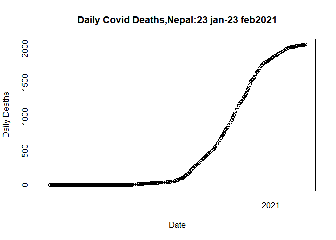
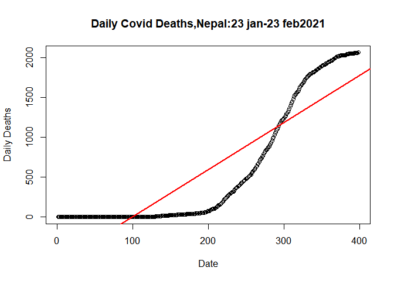
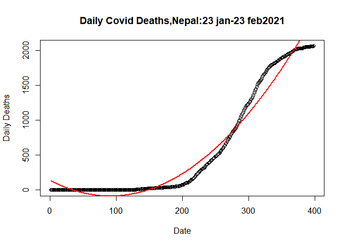
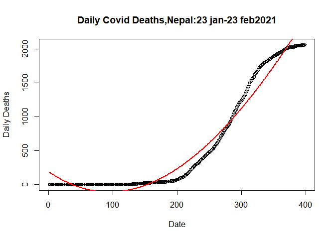

# Polynomial Regression

Curve fitting or curve-linear regression are additional words for the
same thing. It is used when a scatterplot shows a non-linear
relationship. It is most typically employed with time series data, but it
can be applied to a variety of other situations.

## Let’s use the Nepal Covid data and fit a polynomial models on Covid deaths using R

To do this first import excel file in R studio using `readxl` library.
Like below.

``` r
library(readxl)
data <- read_excel("F:/MDS-Private-Study-Materials/First Semester/Statistical Computing with R/Assignments/Data/covid_tbl_final.xlsx")
head(data)
```

    ## # A tibble: 6 x 14
    ##      SN Date                Confirmed_cases_~ Confirmed_cases~ `Confirmed _case~
    ##   <dbl> <dttm>                          <dbl>            <dbl>             <dbl>
    ## 1     1 2020-01-23 00:00:00                 1                1                 1
    ## 2     2 2020-01-24 00:00:00                 1                0                 1
    ## 3     3 2020-01-25 00:00:00                 1                0                 1
    ## 4     4 2020-01-26 00:00:00                 1                0                 1
    ## 5     5 2020-01-27 00:00:00                 1                0                 1
    ## 6     6 2020-01-28 00:00:00                 1                0                 1
    ## # ... with 9 more variables: Recoveries_total <dbl>, Recoveries_daily <dbl>,
    ## #   Deaths_total <dbl>, Deaths_daily <dbl>, RT-PCR_tests_total <dbl>,
    ## #   RT-PCR_tests_daily <dbl>, Test_positivity_rate <dbl>, Recovery_rate <dbl>,
    ## #   Case_fatality_rate <dbl>

`head()` function return top 6 rows of dataframe along with all columns.

``` r
str(data)
```

    ## tibble [495 x 14] (S3: tbl_df/tbl/data.frame)
    ##  $ SN                     : num [1:495] 1 2 3 4 5 6 7 8 9 10 ...
    ##  $ Date                   : POSIXct[1:495], format: "2020-01-23" "2020-01-24" ...
    ##  $ Confirmed_cases_total  : num [1:495] 1 1 1 1 1 1 1 1 1 1 ...
    ##  $ Confirmed_cases_new    : num [1:495] 1 0 0 0 0 0 0 0 0 0 ...
    ##  $ Confirmed _cases_active: num [1:495] 1 1 1 1 1 1 0 0 0 0 ...
    ##  $ Recoveries_total       : num [1:495] 0 0 0 0 0 0 1 1 1 1 ...
    ##  $ Recoveries_daily       : num [1:495] 0 0 0 0 0 0 1 0 0 0 ...
    ##  $ Deaths_total           : num [1:495] 0 0 0 0 0 0 0 0 0 0 ...
    ##  $ Deaths_daily           : num [1:495] 0 0 0 0 0 0 0 0 0 0 ...
    ##  $ RT-PCR_tests_total     : num [1:495] NA NA NA NA NA 3 4 5 5 NA ...
    ##  $ RT-PCR_tests_daily     : num [1:495] NA NA NA NA NA NA 1 1 0 NA ...
    ##  $ Test_positivity_rate   : num [1:495] NA NA NA NA NA ...
    ##  $ Recovery_rate          : num [1:495] 0 0 0 0 0 0 100 100 100 100 ...
    ##  $ Case_fatality_rate     : num [1:495] 0 0 0 0 0 0 0 0 0 0 ...

The’str()’ method examines each column’s data type. The data type number
for Confirmed cases total is the same as the data type number for the
other columns.

## Let us plot the daily deaths by date and see what is causing the problem

``` r
plot(data$Date,data$Deaths_daily, main= "Daily Deaths:23jan 2020-31 may 2021 ",xlab = "Date",
  ylab = "Daily Deaths"   )
```


The problem is associated with the three outliers (all the missed deaths
a priori added to the data on those 3 days!)

## Let us plot the cumulative deaths again before these outliers i.e. till 23 Feb 2021

``` r
plot.data <- data[data$SN <= 398,]
plot(plot.data$Date, plot.data$Deaths_total,
     main= "Daily Covid Deaths,Nepal:23 jan-23 feb2021",
     xlab= "Date",
     ylab= "Daily Deaths")
```


As a result, we eliminate outliers. Our data is now ready to be fitted
into a model. Let’s divide our model into a train set and a test set in
the proportions of 70% to 30%.

``` r
set.seed(132)
ind <- sample(2, nrow(plot.data), replace = T, prob = c(0.7,0.3))
train_data <- plot.data[ind==1,]
test_data <- plot.data[ind==2,]
```

`seed()` function in R is used to reproduce results i.e. it produces the
same sample again and again. When we generate randoms numbers without
set. `seed()` function it will produce different samples at different
time of execution.

## Let us fit a linear model in the filtered data (plot.data) using SN as time variable

``` r
library(caret)
```

    ## Warning: package 'caret' was built under R version 4.1.2

    ## Loading required package: ggplot2

    ## Loading required package: lattice

``` r
lm1 <- lm(plot.data$Deaths_total~plot.data$SN, 
         data= train_data)
```

Using the caret package, we fit a linear model to the covid data. Let’s
make a prediction based on the test data.

Before calculating the linear model summary, it is necessary to master
some concepts in order to comprehend the summary.

`Coefficent of Determination` :

The coefficient of determination is a statistical measurement that
examines how differences in one variable can be explained by the
difference in a second variable. Higher the value of R square better
will be the model.

`Residual Standard Error`:

The residual standard error is used to measure how well a regression
model fits a dataset. Lower the value of residual standard error better
will be the model.

``` r
summary(lm1)
```

    ## 
    ## Call:
    ## lm(formula = plot.data$Deaths_total ~ plot.data$SN, data = train_data)
    ## 
    ## Residuals:
    ##     Min      1Q  Median      3Q     Max 
    ## -537.91 -344.76   22.38  351.50  582.90 
    ## 
    ## Coefficients:
    ##               Estimate Std. Error t value Pr(>|t|)    
    ## (Intercept)  -588.8326    35.1575  -16.75   <2e-16 ***
    ## plot.data$SN    5.9315     0.1527   38.84   <2e-16 ***
    ## ---
    ## Signif. codes:  0 '***' 0.001 '**' 0.01 '*' 0.05 '.' 0.1 ' ' 1
    ## 
    ## Residual standard error: 350 on 396 degrees of freedom
    ## Multiple R-squared:  0.7921, Adjusted R-squared:  0.7916 
    ## F-statistic:  1509 on 1 and 396 DF,  p-value: < 2.2e-16

When we fit a linear model, we get an R2 of 79.21%, which suggests that
only 79.21% of the variance is explained by independent factors in
relation to dependent variables. On 396 degrees of freedom, the value of
residual standard error is 350.

## Let’s plot the linear model

``` r
plot(plot.data$SN, plot.data$Deaths_total, data= plot.data,
     main= "Daily Covid Deaths,Nepal:23 jan-23 feb2021",
     xlab= "Date",
     ylab= "Daily Deaths")
abline(lm(plot.data$Deaths_total~plot.data$SN,data= plot.data), col="red",lwd=2)
```



## Let us fit a quadratic linear model in the filtered data

``` r
qlm <- lm(plot.data$Deaths_total~ poly(plot.data$SN,2), data= train_data)
summary(qlm)
```

    ## 
    ## Call:
    ## lm(formula = plot.data$Deaths_total ~ poly(plot.data$SN, 2), 
    ##     data = train_data)
    ## 
    ## Residuals:
    ##     Min      1Q  Median      3Q     Max 
    ## -422.04 -110.87    8.94   81.97  282.94 
    ## 
    ## Coefficients:
    ##                         Estimate Std. Error t value Pr(>|t|)    
    ## (Intercept)              594.495      6.763   87.90   <2e-16 ***
    ## poly(plot.data$SN, 2)1 13595.485    134.928  100.76   <2e-16 ***
    ## poly(plot.data$SN, 2)2  6428.710    134.928   47.65   <2e-16 ***
    ## ---
    ## Signif. codes:  0 '***' 0.001 '**' 0.01 '*' 0.05 '.' 0.1 ' ' 1
    ## 
    ## Residual standard error: 134.9 on 395 degrees of freedom
    ## Multiple R-squared:  0.9692, Adjusted R-squared:  0.969 
    ## F-statistic:  6211 on 2 and 395 DF,  p-value: < 2.2e-16

The value of R2 96.92 percent was obtained in this case. In terms of
dependent variables, independent factors account for 96.92 percent of
variability. Similarly, the residual standard error on 395 degrees of
freedom is 134.9. In comparison to the linear model, we can see that the
R2 value is increasing and the error is decreasing.

## Let’s plot the quardatic model

``` r
plot(plot.data$SN, plot.data$Deaths_total, data= plot.data,
     main= "Daily Covid Deaths,Nepal:23 jan-23 feb2021",
     xlab= "Date",
     ylab= "Daily Deaths")
```

    ## Warning in plot.window(...): "data" is not a graphical parameter

    ## Warning in plot.xy(xy, type, ...): "data" is not a graphical parameter

    ## Warning in axis(side = side, at = at, labels = labels, ...): "data" is not a
    ## graphical parameter

    ## Warning in axis(side = side, at = at, labels = labels, ...): "data" is not a
    ## graphical parameter

    ## Warning in box(...): "data" is not a graphical parameter

    ## Warning in title(...): "data" is not a graphical parameter

``` r
lines(fitted(qlm)~SN, data=plot.data, col= "red",lwd=2)
```


Quardatic model fited data more welly than linear model.

## Let’s Fit Cubic Model

We fit the cubic model in the following way.

``` r
clm <- lm(plot.data$Deaths_total~poly(SN,3), data= plot.data)
```

Let’s calculate the summary of cubic model and observed what changes
came,

``` r
summary(clm)
```

    ## 
    ## Call:
    ## lm(formula = plot.data$Deaths_total ~ poly(SN, 3), data = plot.data)
    ## 
    ## Residuals:
    ##     Min      1Q  Median      3Q     Max 
    ## -369.58 -123.49   12.82   99.36  267.65 
    ## 
    ## Coefficients:
    ##               Estimate Std. Error t value Pr(>|t|)    
    ## (Intercept)    594.495      6.696  88.789  < 2e-16 ***
    ## poly(SN, 3)1 13595.485    133.576 101.781  < 2e-16 ***
    ## poly(SN, 3)2  6428.710    133.576  48.128  < 2e-16 ***
    ## poly(SN, 3)3  -401.539    133.576  -3.006  0.00282 ** 
    ## ---
    ## Signif. codes:  0 '***' 0.001 '**' 0.01 '*' 0.05 '.' 0.1 ' ' 1
    ## 
    ## Residual standard error: 133.6 on 394 degrees of freedom
    ## Multiple R-squared:  0.9699, Adjusted R-squared:  0.9696 
    ## F-statistic:  4228 on 3 and 394 DF,  p-value: < 2.2e-16

The R-square value is 96.99 percent, and the residual standard error is
133.6. When we compare the prior model to this one, we can immediately
see the differences.

## Let’s Plot the Cubic Model

``` r
plot(plot.data$SN, plot.data$Deaths_total, data= plot.data,
     main= "Daily Covid Deaths,Nepal:23 jan-23 feb2021",
     xlab= "Date",
     ylab= "Daily Deaths")
```

    ## Warning in plot.window(...): "data" is not a graphical parameter

    ## Warning in plot.xy(xy, type, ...): "data" is not a graphical parameter

    ## Warning in axis(side = side, at = at, labels = labels, ...): "data" is not a
    ## graphical parameter

    ## Warning in axis(side = side, at = at, labels = labels, ...): "data" is not a
    ## graphical parameter

    ## Warning in box(...): "data" is not a graphical parameter

    ## Warning in title(...): "data" is not a graphical parameter

``` r
lines(fitted(clm)~plot.data$SN,data = plot.data, col= "red",lwd= 2)
```


From figure we can see that predicted model and actual model are more
closure than in case of quardatic model.

## Let’s Fit Double Quardatic Model

``` r
dlm <- lm(plot.data$Deaths_total~poly(plot.data$SN,4))
```

Let’s calculate the summary of it.

``` r
summary(dlm)
```

    ## 
    ## Call:
    ## lm(formula = plot.data$Deaths_total ~ poly(plot.data$SN, 4))
    ## 
    ## Residuals:
    ##     Min      1Q  Median      3Q     Max 
    ## -105.44  -53.22  -12.50   53.61  159.13 
    ## 
    ## Coefficients:
    ##                        Estimate Std. Error t value Pr(>|t|)    
    ## (Intercept)              594.50       3.13  189.92  < 2e-16 ***
    ## poly(plot.data$SN, 4)1 13595.49      62.45  217.71  < 2e-16 ***
    ## poly(plot.data$SN, 4)2  6428.71      62.45  102.94  < 2e-16 ***
    ## poly(plot.data$SN, 4)3  -401.54      62.45   -6.43 3.71e-10 ***
    ## poly(plot.data$SN, 4)4 -2344.63      62.45  -37.55  < 2e-16 ***
    ## ---
    ## Signif. codes:  0 '***' 0.001 '**' 0.01 '*' 0.05 '.' 0.1 ' ' 1
    ## 
    ## Residual standard error: 62.45 on 393 degrees of freedom
    ## Multiple R-squared:  0.9934, Adjusted R-squared:  0.9934 
    ## F-statistic: 1.486e+04 on 4 and 393 DF,  p-value: < 2.2e-16

In this scenario, the independent variables have a 99.34 percent
variability with respect to the dependent variable. In addition, the
residual standard error is 62.45, which is half of the cubic model’s.

## Let’s fit the Double Quardatic Model

``` r
plot(plot.data$SN, plot.data$Deaths_total, data= plot.data,
     main= "Daily Covid Deaths,Nepal:23 jan-23 feb2021",
     xlab= "Date",
     ylab= "Daily Deaths")
```

    ## Warning in plot.window(...): "data" is not a graphical parameter

    ## Warning in plot.xy(xy, type, ...): "data" is not a graphical parameter

    ## Warning in axis(side = side, at = at, labels = labels, ...): "data" is not a
    ## graphical parameter

    ## Warning in axis(side = side, at = at, labels = labels, ...): "data" is not a
    ## graphical parameter

    ## Warning in box(...): "data" is not a graphical parameter

    ## Warning in title(...): "data" is not a graphical parameter

``` r
lines(fitted(dlm)~plot.data$SN,data = plot.data, col= "red",lwd= 2)
```


Here both the model are near to overlap

## Let’s Plot Fifth Order Ploynomial

``` r
flm <- lm(plot.data$Deaths_total~poly(plot.data$SN,5),data= plot.data)
```

Let’s calculate the summary of flm to see the value of R square and
residual standard error.

``` r
summary(flm)
```

    ## 
    ## Call:
    ## lm(formula = plot.data$Deaths_total ~ poly(plot.data$SN, 5), 
    ##     data = plot.data)
    ## 
    ## Residuals:
    ##     Min      1Q  Median      3Q     Max 
    ## -77.300 -16.980  -3.571  19.199 140.089 
    ## 
    ## Coefficients:
    ##                         Estimate Std. Error t value Pr(>|t|)    
    ## (Intercept)              594.495      1.716  346.36   <2e-16 ***
    ## poly(plot.data$SN, 5)1 13595.485     34.242  397.04   <2e-16 ***
    ## poly(plot.data$SN, 5)2  6428.710     34.242  187.74   <2e-16 ***
    ## poly(plot.data$SN, 5)3  -401.539     34.242  -11.73   <2e-16 ***
    ## poly(plot.data$SN, 5)4 -2344.634     34.242  -68.47   <2e-16 ***
    ## poly(plot.data$SN, 5)5 -1035.863     34.242  -30.25   <2e-16 ***
    ## ---
    ## Signif. codes:  0 '***' 0.001 '**' 0.01 '*' 0.05 '.' 0.1 ' ' 1
    ## 
    ## Residual standard error: 34.24 on 392 degrees of freedom
    ## Multiple R-squared:  0.998,  Adjusted R-squared:  0.998 
    ## F-statistic: 3.973e+04 on 5 and 392 DF,  p-value: < 2.2e-16

In this case, the residual error is approximately half that of the
double quardatic model, and the R square is 99.98 percent. Our model
performs better than the previous one since we used a higher order
ploynomial. As a result, higher order polynomial models are preferred
since they reduce error and improve model accuracy.
